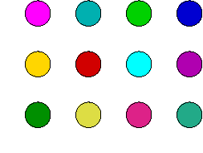

# **Linear Algebra**

## Math 35100

IUPUI, Fall 2020

---
@snap[north span-100]
### **How** will we study Linear Algebra?
@snapend

@snap[south span-90]
@ul[list-spaced-bullets list-style: none text-09]
- Elementary Linear Algebra, H. Anton; 11th ed.
- Dr Rodrigo Perez, rperez@math.iupui.edu
- Weekly assignments 20%, 3 midterm exams 30% ea, Final 20%
- 50-65% **D**, 65-80% **C**, 80-90% **B**, 90-100% **A**
@ulend @snapend

---
@snap[north span-80]
### **Why** do we study Linear Algebra?
@snapend

@snap[south span-70]
@ul[list-spaced-bullets list-style: none text-09]
- Solve systems of linear equations
- Do computer graphics computations
- Solve linear programming optimization problems
- Solve eigen-problems, including
- Markov chain processes
@ulend @snapend

---
@snap[north span-80]
Linear Systems
@snapend

@snap[midpoint span-50]
@math
`\[
   \begin{align*}
     2x &-&  y &+&  z &=&  3 \\
     3x &+& 2y &-&  z &=& -1 \\
      x &-& 3y &+& 2z &=&  2
   \end{align*}
\]`
@mathend @snapend
---
@snap[north span-80]
Linear Systems
@snapend

@snap[midpoint span-50 fragment]
@math
`\[
   \begin{align*}
     2x &-&  y &+&  z &=&  3 \\
     5x &+&  y &&     &=&  2 \\
      x &-& 3y &+& 2z &=&  2
   \end{align*}
  \]`
@mathend @snapend

---
@snap[north span-80]
Linear Systems
@snapend

@snap[midpoint span-50]
@math
`\[
   \begin{align*}
     2x &-&  y &+&  z &=&  3 \\
     5x &+&  y &&     &=&  2 \\
     3x &+&  y &&     &=&  4
   \end{align*}
  \]`
@mathend @snapend

---
@snap[north span-80]
Linear Systems
@snapend

@snap[midpoint span-50]
@math
`\[
   \begin{align*}
     2x &-&  y &+&  z &=&  3 \\
     2x &&     &&     &=& -2 \\
     3x &+&  y &&     &=&  4
   \end{align*}
  \]`
@mathend @snapend

---
@snap[north span-80]
Linear Systems
@snapend

@snap[midpoint span-50]
@math
`\[
   \begin{align*}
     2x &-&  y &+&  z &=&  3 \\
      x &&     &&     &=& -1 \\
     3(-1) &+& y &&   &=&  4
   \end{align*}
  \]`
@mathend @snapend

---
@snap[north span-80]
Linear Systems
@snapend

@snap[midpoint span-50]
@math
`\[
   \begin{align*}
     2x &-&  y &+&  z &=&  3 \\
      x &&     &&     &=& -1 \\
        &&   y &&     &=&  7
   \end{align*}
  \]`
@mathend @snapend

---
@snap[north span-80]
Linear Systems
@snapend

@snap[midpoint span-50]
@math
`\[
   \begin{align*}
     2(-1) &-& 7 &+& z &=&  3 \\
      x    &&    &&    &=& -1 \\
           &&  y &&    &=&  7
   \end{align*}
  \]`
@mathend @snapend

---
@snap[north span-80]
Linear Systems
@snapend

@snap[south fragment]
**We will fix that...**
@snapend

@snap[midpoint span-50]
@math
`\[
   \begin{align*}
      x &&     &&      &=& -1 \\
        &&   y &&      &=&  7 \\
        &&     &&    z &=& 12
   \end{align*}
  \]`
@mathend @snapend

---
@snap[north span-80]
### Computer graphics
@snapend

@snap[midpoint]

@snapend

@snap[south span-80 fragment]
**Want to land a dream job at Pixar?**
@snapend

---
@snap[north span-80]
### Eigenvectors and Markov processes
@snapend

@snap[midpoint span-65]
@img[span-65](assets/img/googlePagerank.jpg)
@snapend

@snap[south fragment span-80]
**Would you like to ace a class that can make you a billionaire?**
@snapend]

---
@snap[north span-80]
### **What** is Linear Algebra?
@snapend

@snap[midpoint span-70]
@ul[list-no-bullets none text-09]
- 49 x 237  +  763 x 49  =  ?
- 49 (237 + 763) =
- 49    (1000)   =
- **49000**
@ulend @snapend

@snap[south span-80 fragment]
The **Distributive Property** (or DP)
@snapend

---
@snap[north span-80]
### Linear Algebra is all about the DP
@snapend

@snap[midpoint span-65]
@quote[If some mathematical objects can be added and multiplied
 by scalars (i.e., numbers), and if the addition and product
 harmonize toghether nicely in the sense of following the (DP),
 then these objects are behaving **LINEARLY**]
@snapend

---
@snap[north span-80]
### **What** is Linear Algebra?
@snapend

@snap[midpoint span-70]
@ul[list-no-bullets list-style: none text-09]
- $3x + 5 = 20$
- $3x     = 15$
- $ x     =  5$
@ulend @snapend

@snap[south span-80]
@ul[list-spaced-bullets list-style: none text-09]
- Vectors
- Matrices
@ulend @snapend

---
@snap[north span-80]
### What is a **vector**?
@snapend
@snap[midpoint span-80 fragment]

@snapend
---
@snap[north span-80]
### What is a **matrix**?
@snapend
@snap[midpoint span-80 fragment]

@snapend

---

### Vectors
1428 Elm Street + 4 Privet Drive

It does not make sense!

---
@snap[north]
### Vectors 1
@snapend
@snap[north fragment span-70]

@snapend
@snap[midpoint fragment]

@snapend
@snap[south fragment span-30]

@snapend
@snap[west fragment span-40]

@snapend
@snap[south-east fragment span-30]

@snapend
@snap[south-west fragment span-40]

@snapend
@snap[east fragment span-30]

@snapend
@snap[north-east fragment span-40]

@snapend

---
@snap[north]
### Vectors 2
@snapend
@snap[west]
@ul[list-no-bullets none text-09]
- Location (points)
- Direction (vectors?)
- Directioncal Instructions
@ulend
@snapend
@snap[midpoint span-60]

@snapend
@snap[south]
1 step down **+** 1 step left
@snapend

---

@snap[north]
### Vectors 3
@snapend

@snap[midpoint]
@math
`$\langle 4,2 \rangle$`
@mathend
@snapend

@snap[midpoint fragment]
@math
`\langle 4,2 \rangle = \langle 4,0 \rangle + \langle 0,2 \rangle`
@mathend
@snapend

@snap[midpoint fragment]
@math
`\langle 4,2 \rangle = \langle 4,0 \rangle + \langle 0,2 \rangle = 4 \langle 1,0 \rangle + 2 \langle 0,1 \rangle`
@mathend
@snapend

@snap[south fragment]
@math
`(2,3) (4,2)`
@mathend
@snapend

@snap[south fragment]
@math
`(2,3) + \langle 2,1 \rangle \qquad (4,2) + \langle 2,1 \rangle`
@mathend
@snapend

@snap[south fragment]
@math
`(2,3) + \langle 2,1 \rangle = (4,4) \qquad (4,2) + \langle 2,1 \rangle = (6,3)`
@mathend
@snapend

---
@snap[north]
### Matrixes 1
@snapend

@snap[midpoint]
@math
`\begin{pmatrix}
1 &  2 &  3 & 4 \\
5 &  6 &  7 & 8 \\
9 & 10 & 11 & 12 \\
\end{pmatrix}`
@mathend
@snapend

@snap[east fragment]
@math
`\downarrow 3 \rightarrow 4`
@mathend
@snapend

@snap[south]
@math
`\begin{pmatrix}
1 & 2 & 3
\end{pmatrix} \qquad
\begin{pmatrix}
1\\2\\3
\end{pmatrix}`
@mathend
@snapend
