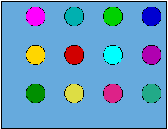

@snap[center span-100]
# **Linear Algebra**

## Math 35100

IUPUI, Fall 2020

@snapend

---
## **Rules**

@ul[list-spaced-bullets text-07]
- No homework (but see syllabus)
- No attendance (skip live session at your own risk)
- Content @fa[copyright] (to share only with classmates)
- Office hours (by appointment)
- Academic conduct (complete 1st assignment on personal integrity)
- Inclusivity (do I need to be explicit?)
- Online behavior (behave as you would in person)
@ulend

---
### **How** to study [LA]?

@snap[west]
@ul[list-spaced-bullets text-07]
- Dr Rodrigo Pérez, rperez@math.iupui.edu
- Elementary Linear Algebra, H. Anton; 11th ed.
- Homework 20%; 2 Tests (25% higher, 20% lower); Final 35%
- Complete the **Honor Code Pledge** assignment
- 50-65% **D**, 65-80% **C**, 80-90% **B**, 90-100% **A**
@ulend
@snapend

@snap[south-west fragment text-06]
www.accessengineeringlibrary.com/content/book/9781260011449

---
### **Why** study [LA]?

@snap[west]
@ul[list-spaced-bullets list-style: none text-09]
- Solve systems of **linear** equations
- Do computer graphics computations
- Solve **linear** programming optimization problems
- Solve eigen-problems, including
- Markov chain processes
@ulend
@snapend

---
### Linear Systems

@snap[midpoint span-50 fragment current-visible]
@math
`\[
   \begin{alignat*}{4}
     2x & {}-{} &  y & {}+{} &  z & {}={} &  3 \\
     3x & {}+{} & 2y & {}-{} &  z & {}={} & -1 \\
      x & {}-{} & 3y & {}+{} & 2z & {}={} &  2
   \end{alignat*}
\]`
@mathend
@snapend

@snap[midpoint span-50 fragment current-visible]
@math
`\[
   \begin{alignat*}{4}
     2x & {}-{} &  y & {}+{} &  z & {}={} &  3 \\
     5x & {}+{} &  y &&     & {}={} &  2 \\
      x & {}-{} & 3y & {}+{} & 2z & {}={} &  2
   \end{alignat*}
  \]`
@mathend
@snapend

---
### Linear Systems

@snap[midpoint span-50]
@math
`\[
   \begin{alignat*}{4}
     2x & {}-{} &  y & {}+{} &  z & {}={} &  3 \\
     5x & {}+{} &  y &&     & {}={} &  2 \\
     3x & {}+{} &  y &&     & {}={} &  4
   \end{alignat*}
  \]`
@mathend
@snapend

---
### Linear Systems

@snap[midpoint span-50]
@math
`\[
   \begin{alignat*}{4}
     2x & {}-{} &  y & {}+{} &  z & {}={} &  3 \\
     2x &&     &&     & {}={} & -2 \\
     3x & {}+{} &  y &&     & {}={} &  4
   \end{alignat*}
  \]`
@mathend
@snapend

---
### Linear Systems

@snap[midpoint span-50]
@math
`\[
   \begin{alignat*}{4}
     2x & {}-{} &  y & {}+{} &  z & {}={} &  3 \\
      x &&     &&     & {}={} & -1 \\
     3(-1) & {}+{} & y &&   & {}={} &  4
   \end{alignat*}
  \]`
@mathend
@snapend

---
### Linear Systems

@snap[midpoint span-50]
@math
`\[
   \begin{alignat*}{4}
     2x & {}-{} &  y & {}+{} &  z & {}={} &  3 \\
      x &&     &&     & {}={} & -1 \\
        &&   y &&     & {}={} &  7
   \end{alignat*}
  \]`
@mathend
@snapend

---
### Linear Systems

@snap[midpoint span-50]
@math
`\[
   \begin{alignat*}{4}
     2(-1) & {}-{} & 7 & {}+{} & z & {}={} &  3 \\
      x    &&    &&    & {}={} & -1 \\
           &&  y &&    & {}={} &  7
   \end{alignat*}
  \]`
@mathend
@snapend

---
### Linear Systems

@snap[south fragment]
*Too cumbersome!*

**We will fix that...**
@snapend

@snap[midpoint span-50]
@math
`\[
   \begin{alignat*}{4}
      x &&     &&      & {}={} & -1 \\
        &&   y &&      & {}={} &  7 \\
        &&     &&    z & {}={} & 12
   \end{alignat*}
  \]`
@mathend
@snapend

---
### Computer Graphics

@snap[midpoint]

@snapend

@snap[south]
**Want that dream job at Pixar?**
@snapend

---
### Eigenvectors &

### Markov Processes

@snap[midpoint span-70]
@img[span-65](assets/img/Class01/googlePagerank.jpg)
@snapend

@snap[south]
**This class could make you a billionaire**
@snapend]

---
### [LA] is all about Distributivity (I)

@snap[midpoint]
@ul[list-no-bullets]
- 49 x 237  +  763 x 49  =  ?
- 49 (237 + 763) =
- 49    (1000)   =
- **49000**
@ulend
@snapend

@snap[south fragment]
The Distributive Property (or **DP**)
@snapend

---
### [LA] is all about Distributivity (II)

If some mathematical objects:

@ul
- Can be added together
- Can be multiplied by scalars (i.e., numbers)
- Obey the DP (addition and scalar product harmonize toghether)
@ulend

@snap[fragment]
Then these objects behave **linearly**
@snapend

---
### [LA] is all about Distributivity (III)

@snap[midpoint]
@ul[list-no-bullets]
- $3x + 5 = 20$
- $3x     = 15 \color{yellow}{\text{ or }} x + \tfrac{5}{3} = \tfrac{20}{3} \qquad$
- $ x     =  5$
@ulend
@snapend

@ul[south-east list-spaced-bullets]
- Numbers
- Vectors
- Matrices
- & other
@ulend

---
### What is a . . .

@snap[midpoint span-80 fragment]

@snapend

---?image=assets/img/Class01/matrixBKGD.jpg
@snap[west]
## What is a **matrix**?
@snapend

---
### Vectors (I)
**Can addresses be added?**

@snap[west span-70 fragment]
1428 Elm Street + 4 Privet Drive
@snapend

@snap[south-west span-30]

@snapend

@snap[south span-40]

@snapend

@snap[south-east fragment span-30]

It does not make sense!
@snapend

---
### Vectors (II)
**Position vs direction**

@snap[midpoint fragment span-70 fragment step-fade-in-then-out]

@snapend
@snap[midpoint fragment]

@snapend
@snap[south fragment span-30]

@snapend
@snap[west fragment span-25]

@snapend
@snap[south-east fragment span-25]

@snapend
@snap[south-west fragment span-30]

@snapend
@snap[east fragment span-25]

@snapend
@snap[north-east fragment span-30]

@snapend

---
### Vectors (III)

@snap[west]
@ul[list-spaced-bullets]
- Location (as in *points*)
- Direction (vectors? **NO!**)
- Directional Instructions
@ulend
@snapend

@snap[east fragment span-60 text-06]

1 step down **+** 1 step left
@snapend

---
### Vectors (IV)

@snap[midpoint fragment current-visible]
@math[fragment step-fade-in-then-out]
`$\langle 4,2 \rangle \phantom{ = \langle 4,0 \rangle + \langle 0,2 \rangle = 4 \langle 1,0 \rangle + 2 \langle 0,1 \rangle}$`
@mathend
@snapend

@snap[midpoint fragment current-visible]
@math[fragment step-fade-in-then-out]
`$\langle 4,2 \rangle = \langle 4,0 \rangle + \langle 0,2 \rangle  \phantom{ = 4 \langle 1,0 \rangle + 2 \langle 0,1 \rangle}$`
@mathend
@snapend

@snap[midpoint fragment]
@math[fragment step-fade-in-then-out]
`$\langle 4,2 \rangle = \langle 4,0 \rangle + \langle 0,2 \rangle = 4 \langle 1,0 \rangle + 2 \langle 0,1 \rangle$`
@mathend
@snapend

@snap[south fragment current-visible]
@math[fragment step-fade-in-then-out]
`$(2,3) \phantom{+ \langle 2,1 \rangle = (4,4)} \qquad (4,2) \phantom{+ \langle 2,1 \rangle = (6,3)}$`
@mathend
@snapend

@snap[south fragment current-visible]
@math[fragment step-fade-in-then-out]
`$(2,3) + \langle 2,1 \rangle \phantom{= (4,4)} \qquad (4,2) + \langle 2,1 \rangle \phantom{= (6,3)}
$`
@mathend
@snapend

@snap[south fragment current-visible]
@math[fragment step-fade-in-then-out]
`$(2,3) + \langle 2,1 \rangle = (4,4) \qquad (4,2) + \langle 2,1 \rangle = (6,3)$`
@mathend
@snapend

---
### Matrices (I)
**$\S$1.3 &ndash; Blocks of Numbers**

@snap[midpoint fragment]
@math[]
`$\begin{pmatrix}
1 &  2 &  3 & 4 \\
5 &  6 &  7 & 8 \\
9 & 10 & 11 & 12 \\
\end{pmatrix}$`
@mathend
@snapend

@snap[east fragment text-07]
@math[fragment step-fade-in-then-out]
`${\large\downarrow 3 \quad \rightarrow 4}$`
@mathend

so a

$3 \times 4$ matrix
@snapend

@snap[south fragment text-06]
@math
`$\begin{pmatrix}
1 & 2 & 3
\end{pmatrix}_{\text{this one is } 1 \times 3} \qquad
\begin{pmatrix}
1\\2\\3
\end{pmatrix}_{\text{this one is } 3 \times 1}$`
@mathend
@snapend

---
### Matrices (II)
**$\S$1.3 &ndash; Systems of Equations as Matrices**

@snap[midpoint fragment text-07]
@math
`\[
  \begin{alignat*}{4}
    2x & {}-{} &  y & {}+{} &  z & {}={} &  3 \\
    3x & {}+{} & 2y & {}-{} &  z & {}={} & -1 \\
     x & {}-{} & 3y & {}+{} & 2z & {}={} &  2
  \end{alignat*}
  \longrightarrow
  \begin{pmatrix}
    2 & -1 &  1 &  \color{blue}{3} \\
    3 &  2 & -1 & \color{blue}{-1} \\
    1 & -3 &  2 &  \color{blue}{2}
  \end{pmatrix}
\]`
@mathend
@snapend

---
### Matrices (III)
**$\S$1.3 &ndash; Addition and Scalar Product**

@snap[midpoint text-07]
@math
`$\begin{pmatrix}
1 &  2 &  3 & 4 \\
5 &  6 &  7 & 8 \\
9 & 10 & 11 & 12 \\
\end{pmatrix} +
\begin{pmatrix}
1 & 4 & 7 & 10 \\
2 & 5 & 8 & 11 \\
3 & 6 & 9 & 12 \\
\end{pmatrix} =
\begin{pmatrix}
 2 &  6 & 10 & 14 \\
 7 & 11 & 15 & 19 \\
12 & 16 & 20 & 24 \\
\end{pmatrix}$`
@mathend
@snapend

@snap[south fragment text-07]
@math
`$ 5
\begin{pmatrix}
1 &  2 &  3 & 4 \\
5 &  6 &  7 & 8 \\
9 & 10 & 11 & 12 \\
\end{pmatrix} =
\begin{pmatrix}
 5 & 10 & 15 & 20 \\
25 & 30 & 35 & 40 \\
45 & 50 & 55 & 60 \\
\end{pmatrix}$`
@mathend
@snapend

---
### Matrices (IV)
**$\S$1.3 &ndash; Matrix Multiplication**

@snap[midpoint span-60 fragment]

@snapend

---
### Matrices (V)
**$\S$1.3 &ndash; Rules**

@snap[text-07]
@ol
1. $A+B = B+A$
1. $A+(B+C) = (A+B)+C$
1. $A(BC) = (AB)C$
1. $A(B+C) = AB + AC$
1. $(A+B)C = AC + BC$
1. $s(B+C) = sB + sC$
1. $(s+t)C = sC + tC$
1. $s(tC) = (st)C$
1. $s(BC) = (sB)C$
1. $A+0 = 0+A = A$
1. $A+(-1)A = A-A = 0$
1. $0A = A0 = 0$
1. $sA = 0$ means that either $s=0$ or $A=0$
@olend
@snapend

---
### Matrices (VI)
**$\S$1.4 &ndash; Inverses**

@ul[list-no-bullets text-07]
- $A \cdot A^{-1} = A^{-1} \cdot A = I$
- $(A \cdot B) \cdot (B^{-1} \cdot A^{-1}) = A \cdot (B \cdot B^{-1}) \cdot A^{-1} = A \cdot I \cdot A^{-1} = A \cdot A^{-1} = I$
- i.e., $(A \cdot B)^{-1} = B^{-1} \cdot A^{-1}$
- $A^n = A \cdot \ldots \cdot A$, and $A^{-n} = (A^{-1})^n = A^{-1} \cdot \ldots \cdot A^{-1}$
- $A^r \cdot A^s = A^{r+s}$ and $(A^r)^s = A^{rs}$
- If $k \neq 0$ and $A$ is invertible, then
- $\circ\quad (A^{-1})^{-1} = A$,
- $\circ\quad (A^n)^{-1} = A^{-n} = (A^{-1})^n$, and
- $\circ\quad (kA)^{-1} = \tfrac{1}{k}A^{-1}$
- $(kA) \cdot (\tfrac{1}{k}A^{-1}) = \tfrac{1}{k} (kA) \cdot A^{-1} = (\tfrac{1}{k} k) A \cdot A^{-1} = (1)I = I$
- i.e., $(kA)^{-1} = \tfrac{1}{k}A^{-1}$
@ulend

@snap[south-east fragment text-07]
@math
`\[
  \begin{pmatrix}a&b\\c&d\end{pmatrix}^{-1} = \tfrac{1}{ad-bc} \begin{pmatrix}d&-b\\-c&a\end{pmatrix}
\]`
@mathend
@snapend

---
### Matrices (VII)
**$\S$1.4 &ndash; Transposing a Matrix**

@snap[south fragment text-08]
@math
`\[
  \begin{pmatrix}1&2&3&4\\5&6&7&8\\9&10&11&12\end{pmatrix}^T = \begin{pmatrix}1&5&9\\2&6&10\\3&7&11\\4&8&12\end{pmatrix}
\]`
@mathend
@snapend

@ul[list-no-bullets text-07]
- $(A^T)^T = A$
- $(A + B)^T = A^T + B^T$
- $(kA)^T = kA^T$
- $(A \cdot B)^T = B^T \cdot A^T$
- $(A^T)^{-1} = (A^{-1})^T$
@ulend

---
### Summary 1

@ul[list-spaced-bullets text-08]
- **[LA]** is all about Distributivity
- Numbers, vectors, and matrices are distributive, which is why these are the objects studied in [LA]
- Think of vectors as *directional instructions*
- Think of matrices as blocks of numbers with meaning...
- ... but also with arithmetic properties (including a multiplicative inverse), and a transpose operation
@ulend

---
### Gaussian Elimination (I)
**$\S$1.2 &ndash; More Efficient System Solving**

@snap[west fragment current-visible]
@math[fragment step-fade-in-then-out]
`\[
  \begin{alignat*}{4}
    \phantom{-}
    2x & {}-{} &  y & {}+{} &  z & {}={} &  3 \\
    3x & {}+{} & 2y & {}-{} &  z & {}={} & -1 \\
     x & {}-{} & 3y & {}+{} & 2z & {}={} &  2
  \end{alignat*}
  \longrightarrow
  \begin{pmatrix}
    \phantom{-}
    2 & -1 &  1 &  \color{blue}{3} \\
    3 &  2 & -1 & \color{blue}{-1} \\
    1 & -3 &  2 &  \color{blue}{2}
  \end{pmatrix}
\]`
@mathend
@snapend

@snap[west fragment current-visible]
@math[fragment step-fade-in-then-out]
`\[{\ }{\ }
  \begin{alignat*}{4}
    \phantom{-}
     x & {}-{} & 3y & {}+{} & 2z & {}={} &  2 \\
    3x & {}+{} & 2y & {}-{} &  z & {}={} & -1 \\
    2x & {}-{} &  y & {}+{} &  z & {}={} &  3
  \end{alignat*}
  \longrightarrow
  \begin{pmatrix}
    \phantom{-}
    1 & -3 &  2 &  \color{blue}{2} \\
    3 &  2 & -1 & \color{blue}{-1} \\
    2 & -1 &  1 &  \color{blue}{3}
  \end{pmatrix}
\]`
@mathend
@snapend

@snap[west fragment current-visible]
@math[fragment step-fade-in-then-out]
`\[
  \begin{alignat*}{4}
    -2x & {}+{} & 6y & {}-{} & 4z & {}={} & -4 \\
     3x & {}+{} & 2y & {}-{} &  z & {}={} & -1 \\
     2x & {}-{} &  y & {}+{} &  z & {}={} &  3
  \end{alignat*}
  \longrightarrow
  \begin{pmatrix}
    -2 &  6 & -4 & \color{blue}{-4} \\
     3 &  2 & -1 & \color{blue}{-1} \\
     2 & -1 &  1 &  \color{blue}{3}
  \end{pmatrix}
\]`
@mathend
@snapend

@snap[west fragment current-visible]
@math[fragment step-fade-in-then-out]
`\[
  \begin{alignat*}{4}
    -2x & {}+{} & 6y & {}-{} & 4z & {}={} & -4 \\
     3x & {}+{} & 2y & {}-{} &  z & {}={} & -1 \\
        &&        5y & {}-{} & 3z & {}={} & -1
  \end{alignat*}
  \longrightarrow
  \begin{pmatrix}
    -2 & 6 &        -4 & \color{blue}{-4} \\
     3 & 2 &        -1 & \color{blue}{-1} \\
     0 & \phantom{-} 5 & -3 & \color{blue}{-1}
  \end{pmatrix}
\]`
@mathend
@snapend

---
### Gaussian Elimination (II)
**$\S$1.2 &ndash; The Full Procedure**

@snap[east fragment current-visible]
@math[fragment step-fade-in-then-out]
`\[
  \begin{pmatrix}
    2 & -1 &  1 &  \color{blue}{3} \\
    3 &  2 & -1 & \color{blue}{-1} \\
    1 & -3 &  2 &  \color{blue}{2}
  \end{pmatrix}
\]`
@mathend
@snapend

@snap[east fragment current-visible]
@math[fragment step-fade-in-then-out]
`\[
  \begin{pmatrix}
    1 & -3 &  2 &  \color{blue}{2} \\
    3 &  2 & -1 & \color{blue}{-1} \\
    2 & -1 &  1 &  \color{blue}{3}
  \end{pmatrix}
\]`
@mathend
@snapend

@snap[east fragment current-visible]
@math[fragment step-fade-in-then-out]
`\[
  \begin{pmatrix}
    1 & -3 &  2 &  \color{blue}{2} \\
    0 & 11 & -7 & \color{blue}{-7} \\
    2 & -1 &  1 &  \color{blue}{3}
  \end{pmatrix}
\]`
@mathend
@snapend

@snap[east fragment current-visible]
@math[fragment step-fade-in-then-out]
`\[
  \begin{pmatrix}
    1 & -3 &  2 &  \color{blue}{2} \\
    0 & 11 & -7 & \color{blue}{-7} \\
    0 &  5 & -3 & \color{blue}{-1}
  \end{pmatrix}
\]`
@mathend
@snapend

@snap[east color-red fragment current-visible]
@math[fragment step-fade-in-then-out]
`\[
  \begin{pmatrix}
    1 & -3 &  2 &  \color{blue}{2} \\
    0 &  1 & \tfrac{-7}{11} & \color{blue}{\tfrac{-7}{11}} \\
    0 &  5 & -3 & \color{blue}{-1}
  \end{pmatrix}
\]`
@mathend
@snapend

@snap[east fragment current-visible]
@math[fragment step-fade-in-then-out]
`\[
  \begin{pmatrix}
    1 & -3 &  2 &  \color{blue}{2} \\
    0 & 11 & -7 & \color{blue}{-7} \\
    0 &  5 & -3 & \color{blue}{-1}
  \end{pmatrix}
\]`
@mathend
@snapend

@snap[east fragment current-visible]
@math[fragment step-fade-in-then-out]
`\[
  \begin{pmatrix}
    1 & -3 &  2 &  \color{blue}{2} \\
    0 &  1 & -1 & \color{blue}{-5} \\
    0 &  5 & -3 & \color{blue}{-1}
  \end{pmatrix}
\]`
@mathend
@snapend

@snap[east fragment current-visible]
@math[fragment step-fade-in-then-out]
`\[
  \begin{pmatrix}
    1 & 0 & -1 & \color{blue}{-13} \\
    0 & 1 & -1 &  \color{blue}{-5} \\
    0 & 5 & -3 &  \color{blue}{-1}
  \end{pmatrix}
\]`
@mathend
@snapend

@snap[east fragment current-visible]
@math[fragment step-fade-in-then-out]
`\[
  \begin{pmatrix}
    1 & 0 & -1 & \color{blue}{-13} \\
    0 & 1 & -1 &  \color{blue}{-5} \\
    0 & 0 &  2 &  \color{blue}{24}
  \end{pmatrix}
\]`
@mathend
@snapend

@snap[east fragment current-visible]
@math[fragment step-fade-in-then-out]
`\[
  \begin{pmatrix}
    1 & 0 & -1 & \color{blue}{-13} \\
    0 & 1 & -1 &  \color{blue}{-5} \\
    0 & 0 &  1 &  \color{blue}{12}
  \end{pmatrix}
\]`
@mathend
@snapend

@snap[east fragment current-visible]
@math[fragment step-fade-in-then-out]
`\[
  \begin{pmatrix}
    1 & 0 &  0 &  \color{blue}{-1} \phantom{3} \\
    0 & 1 & -1 &  \color{blue}{-5} \\
    0 & 0 &  1 &  \color{blue}{12}
  \end{pmatrix}
\]`
@mathend
@snapend

@snap[east fragment current-visible]
@math[fragment step-fade-in]
`\[
  \begin{pmatrix}
    1 & 0 & 0 &  \color{blue}{-1} \\
    0 & 1 & 0 &   \color{blue}{7} \\
    0 & 0 & 1\phantom{-} &  \color{blue}{12}
  \end{pmatrix}
\]`
@mathend
@snapend

@snap[east fragment current-visible]
@math[fragment step-fade-in-then-out]
`\[
\begin{alignat*}{4}
    x & &   & &   & {}={} & -1 \\
      & & y & &   & {}={} &  7 \\
      & &   & & z & {}={} &  12
  \end{alignat*}
\qquad
  \begin{pmatrix}
    1 & 0 & 0 &  \color{blue}{-1} \\
    0 & 1 & 0 &   \color{blue}{7} \\
    0 & 0 & 1\phantom{-} &  \color{blue}{12}
  \end{pmatrix}
\]`
@mathend
@snapend

---
### Reduced Row Echelon Form
**$\S$1.2 &ndash; or RREF for friends**

@snap[midpoint fragment current-visible text-08]
@math[fragment step-fade-in-then-out]
`\[
  \begin{pmatrix}
    0 & 1 & 0 & {\color{yellow}{*}} & {\color{yellow}{*}} & 0 & {\color{yellow}{*}} & 0 & 0 & {\color{yellow}{*}} \\
    0 & 0 & 1 & {\color{yellow}{*}} & {\color{yellow}{*}} & 0 & {\color{yellow}{*}} & 0 & 0 & {\color{yellow}{*}} \\
    0 & 0 & 0 & 0                   & 0                   & 1 & {\color{yellow}{*}} & 0 & 0 & {\color{yellow}{*}} \\
    0 & 0 & 0 & 0                   & 0                   & 0 & 0                   & 1 & 0 & {\color{yellow}{*}} \\
    0 & 0 & 0 & 0                   & 0                   & 0 & 0                   & 0 & 1 & {\color{yellow}{*}} \\
    0 & 0 & 0 & 0                   & 0                   & 0 & 0                   & 0 & 0 & 0
  \end{pmatrix}
\]`
@mathend
@snapend

@snap[midpoint fragment current-visible text-08]
@math[fragment step-fade-in-then-out]
`\[
  \begin{pmatrix}
    0 & 1 & 0 & \color{yellow}{2} & \color{yellow}{5} & 0 & \color{yellow}{0} & 0 & 0 & \color{yellow}{2} \\
    0 & 0 & 1 & \color{yellow}{1} & \color{yellow}{0} & 0 & \color{yellow}{4} & 0 & 0 & \color{yellow}{1} \\
    0 & 0 & 0 & 0                 & 0                 & 1 & \color{yellow}{3} & 0 & 0 & \color{yellow}{0} \\
    0 & 0 & 0 & 0                 & 0                 & 0 & 0                 & 1 & 0 & \color{yellow}{7} \\
    0 & 0 & 0 & 0                 & 0                 & 0 & 0                 & 0 & 1 & \color{yellow}{6} \\
    0 & 0 & 0 & 0                 & 0                 & 0 & 0                 & 0 & 0 & 0
  \end{pmatrix}
\]`
@mathend
@snapend

---
### Systems with many solutions (I)
**$\S$1.2 &ndash; When the RREF is not identity**

@snap[west fragment]
@math
`\[
   \begin{alignat*}{4}
      x & {}+{} & 2y & {}+{} & 3z & {}={} &  8 \\
     4x & {}+{} & 5y & {}+{} & 6z & {}={} & 23 \\
     7x & {}+{} & 8y & {}+{} & 9z & {}={} & 38
   \end{alignat*}
  \]`
@mathend
@snapend

@snap[east fragment current-visible]
@math[fragment step-fade-in-then-out]
`\[
  \begin{pmatrix}
    1 & 2\phantom{-} & 3\phantom{-} &  \color{blue}{8} \\
    4 & 5            & 6\phantom{2} & \color{blue}{23} \\
    7 & 8            & 9            & \color{blue}{38}\phantom{-}
  \end{pmatrix}
\]`
@mathend
@snapend

@snap[east fragment current-visible]
@math[fragment step-fade-in-then-out]
`\[
  \begin{pmatrix}
    1 &  2 &  3 &  \color{blue}{8} \\
    0 & -3 & -6 & \color{blue}{-9} \\
    7 &  8 &  9 & \color{blue}{38}\phantom{-}
  \end{pmatrix}
\]`
@mathend
@snapend

@snap[east fragment current-visible]
@math[fragment step-fade-in-then-out]
`\[
  \begin{pmatrix}
    1 &  2 &   3 &   \color{blue}{8} \\
    0 & -3 &  -6 &  \color{blue}{-9} \\
    0 & -6 & -12 & \color{blue}{-18}
  \end{pmatrix}
\]`
@mathend
@snapend

@snap[east fragment current-visible]
@math[fragment step-fade-in-then-out]
`\[
  \begin{pmatrix}
    1 &  2 &   3 &   \color{blue}{8} \\
    0 &  1 &   2 &   \color{blue}{3} \\
    0 & -6 & -12 & \color{blue}{-18}
  \end{pmatrix}
\]`
@mathend
@snapend

@snap[east fragment current-visible]
@math[fragment step-fade-in-then-out]
`\[
  \begin{pmatrix}
    1 &  0 &  -1 &   \color{blue}{2} \\
    0 &  1 &   2 &   \color{blue}{3} \\
    0 & -6 & -12 & \color{blue}{-18}
  \end{pmatrix}
\]`
@mathend
@snapend

@snap[east fragment]
@math
`\[
  \begin{pmatrix}
    1 & 0\phantom{-} & -1 &  \color{blue}{2} \\
    0 & 1            &  2 &  \color{blue}{3} \\
    0 & 0            &  0 &  \phantom{-}\color{blue}{0}\phantom{2}
  \end{pmatrix}
\]`
@mathend
@snapend

@snap[south-west fragment]
@math
`\[
   \begin{alignat*}{4}
      x & {} {} &   & {}-{} &  z & {}={} & 2 \\
        & {} {} & y & {}+{} & 2z & {}={} & 3 \\
      0 & {}+{} & 0 & {}+{} &  0 & {}={} & 0
   \end{alignat*}
  \]`
@mathend
@snapend

@snap[south fragment]
@math
`\[\qquad
   \begin{alignat*}{4}
      x & {}={} & 2 -   {\color{green}{t}} \\
      y & {}={} & 3 - 2 {\color{green}{t}} \\
      z & {}={} &       {\color{green}{t}}
   \end{alignat*}
  \]`
@mathend
@snapend

---
### Systems with many solutions (II)
**$\S$1.2 &ndash; General Method**

@snap[west text-07]
@math[]
`\[
  \begin{pmatrix}
    0 & {\color{yellow}{1}} & 0 & 2 & 5 & 0 & 0 & 0 & 0 & 2 \\
    0 & 0 & {\color{yellow}{1}} & 1 & 0 & 0 & 4 & 0 & 0 & 1 \\
    0 & 0 & 0 & 0 & 0 & {\color{yellow}{1}} & 3 & 0 & 0 & 0 \\
    0 & 0 & 0 & 0 & 0 & 0 & 0 & {\color{yellow}{1}} & 0 & 7 \\
    0 & 0 & 0 & 0 & 0 & 0 & 0 & 0 & {\color{yellow}{1}} & 6 \\
    0 & 0 & 0 & 0 & 0 & 0 & 0 & 0 & 0 & 0
  \end{pmatrix}
\]`
@mathend
@snapend

@snap[east fragment current-visible text-07]
@math[fragment step-fade-in-then-out]
`\[
   \begin{alignat*}{4}
      x_1 & {}={} &  \\
      x_2 & {}={} & \phantom{2-2b-5c} \\
      x_3 & {}={} &  \\
      x_4 & {}={} &  \\
      x_5 & {}={} &  \\
      x_6 & {}={} &  \\
      x_7 & {}={} &  \\
      x_8 & {}={} &  \\
      x_9 & {}={} &  \\
   \end{alignat*}
  \]`
@mathend
@snapend

@snap[east fragment current-visible text-07]
@math[fragment step-fade-in-then-out]
`\[
   \begin{alignat*}{4}
      x_1 & {}={} & a \\
      x_2 & {}={} & \phantom{2-2b-5c} \\
      x_3 & {}={} &   \\
      x_4 & {}={} &   \\
      x_5 & {}={} &   \\
      x_6 & {}={} &   \\
      x_7 & {}={} &   \\
      x_8 & {}={} &   \\
      x_9 & {}={} &   \\
   \end{alignat*}
  \]`
@mathend
@snapend

@snap[east fragment current-visible text-07]
@math[fragment step-fade-in-then-out]
`\[
   \begin{alignat*}{4}
      x_1 & {}={} & a \\
      x_2 & {}={} & \phantom{2-2b-5c} \\
      x_3 & {}={} &   \\
      x_4 & {}={} & b \\
      x_5 & {}={} &   \\
      x_6 & {}={} &   \\
      x_7 & {}={} &   \\
      x_8 & {}={} &   \\
      x_9 & {}={} &   \\
   \end{alignat*}
  \]`
@mathend
@snapend

@snap[east fragment current-visible text-07]
@math[fragment step-fade-in-then-out]
`\[
   \begin{alignat*}{4}
      x_1 & {}={} & a \\
      x_2 & {}={} & \phantom{2-2b-5c} \\
      x_3 & {}={} &   \\
      x_4 & {}={} & b \\
      x_5 & {}={} & c \\
      x_6 & {}={} &   \\
      x_7 & {}={} & d \\
      x_8 & {}={} &   \\
      x_9 & {}={} &   \\
   \end{alignat*}
  \]`
@mathend
@snapend

@snap[east fragment current-visible text-07]
@math[fragment step-fade-in-then-out]
`\[
   \begin{alignat*}{4}
      x_1 & {}={} & a \\
      x_2 & {}={} & \phantom{2-2b-5c} \\
      x_3 & {}={} &   \\
      x_4 & {}={} & b \\
      x_5 & {}={} & c \\
      x_6 & {}={} &   \\
      x_7 & {}={} & d \\
      x_8 & {}={} &   \\
      x_9 & {}={} & 6 \\
   \end{alignat*}
  \]`
@mathend
@snapend

@snap[east fragment current-visible text-07]
@math[fragment step-fade-in-then-out]
`\[
   \begin{alignat*}{4}
      x_1 & {}={} & a \\
      x_2 & {}={} & \phantom{2-2b-5c} \\
      x_3 & {}={} &   \\
      x_4 & {}={} & b \\
      x_5 & {}={} & c \\
      x_6 & {}={} &   \\
      x_7 & {}={} & d \\
      x_8 & {}={} & 7 \\
      x_9 & {}={} & 6 \\
   \end{alignat*}
  \]`
@mathend
@snapend

@snap[east fragment current-visible text-07]
@math[fragment step-fade-in-then-out]
`\[
   \begin{alignat*}{4}
      x_1 & {}={} &   a \\
      x_2 & {}={} & \phantom{2-2b-5c} \\
      x_3 & {}={} &     \\
      x_4 & {}={} &   b \\
      x_5 & {}={} &   c \\
      x_6 & {}={} & -3d \\
      x_7 & {}={} &   d \\
      x_8 & {}={} &   7 \\
      x_9 & {}={} &   6 \\
   \end{alignat*}
  \]`
@mathend
@snapend

@snap[east fragment current-visible text-07]
@math[fragment step-fade-in-then-out]
`\[
   \begin{alignat*}{4}
      x_1 & {}={} &   a \\
      x_2 & {}={} & \phantom{2-2b-5c} \\
      x_3 & {}={} &  1-b-4d \\
      x_4 & {}={} &   b \\
      x_5 & {}={} &   c \\
      x_6 & {}={} & -3d \\
      x_7 & {}={} &   d \\
      x_8 & {}={} &   7 \\
      x_9 & {}={} &   6 \\
   \end{alignat*}
  \]`
@mathend
@snapend

@snap[east fragment current-visible text-07]
@math[fragment step-fade-in-then-out]
`\[
   \begin{alignat*}{4}
      x_1 & {}={} &   a \\
      x_2 & {}={} &  2-2b-5c \\
      x_3 & {}={} &  1-b-4d \\
      x_4 & {}={} &   b \\
      x_5 & {}={} &   c \\
      x_6 & {}={} & -3d \\
      x_7 & {}={} &   d \\
      x_8 & {}={} &   7 \\
      x_9 & {}={} &   6 \\
   \end{alignat*}
  \]`
@mathend
@snapend

---
### Elementary Matrices (I)
**$\S$1.5 &ndash; Row Operations as Matrix Multiplication**

@snap[midpoint fragment current-visible text-07]
@math[fragment step-fade-in-then-out]
`\[
  \begin{pmatrix}
    1&0&0\\0&0&{\color{yellow}{1}}\\0&{\color{yellow}{1}}&0
  \end{pmatrix}
  \cdot
  \begin{pmatrix}
    1 & 4 & 7 & 10 \\
    2 & 5 & 8 & 11 \\
    3 & 6 & 9 & 12
  \end{pmatrix}
  =
  \begin{pmatrix}
    1 & 4 & 7 & 10 \\
    {\color{yellow}{3}} & {\color{yellow}{6}} & {\color{yellow}{9}} & {\color{yellow}{12}} \\
    {\color{green}{2}} & {\color{green}{5}} & {\color{green}{8}} & {\color{green}{11}}
  \end{pmatrix}
\]`
@mathend
@snapend

@snap[midpoint fragment current-visible text-07]
@math[fragment step-fade-in-then-out]
`\[
  \begin{pmatrix}
    {\color{yellow}{-5}}&0&0\\0&1&0\\0&0&1
  \end{pmatrix}
  \cdot
  \begin{pmatrix}
    1 & 4 & 7 & 10 \\
    2 & 5 & 8 & 11 \\
    3 & 6 & 9 & 12
  \end{pmatrix}
  =
  \begin{pmatrix}
    {\color{green}{-5}} & {\color{green}{-20}} & {\color{green}{-35}} & {\color{green}{-50}} \\
    2 &  5 &  8 & 11 \\
    3 &  6 &  9 & 12
  \end{pmatrix}
\]`
@mathend
@snapend

@snap[midpoint fragment current-visible text-07]
@math[fragment step-fade-in-then-out]
`\[
  \begin{pmatrix}
    1&0&0\\0&1&{\color{yellow}{3}}\\0&0&1
  \end{pmatrix}
  \cdot
  \begin{pmatrix}
    1 & 4 & 7 & 10 \\
    2 & 5 & 8 & 11 \\
    3 & 6 & 9 & 12
  \end{pmatrix}
  =
  \begin{pmatrix}
     1 &  4 &  7 & 10 \\
    {\color{green}{11}} & {\color{green}{23}} & {\color{green}{35}} & {\color{green}{47}} \\
     3 &  6 &  9 & 12
  \end{pmatrix}
\]`
@mathend
@snapend

---
### Elementary Matrices (II)
**$\S$1.5 &ndash; Invertibility**

@snap[midpoint fragment current-visible text-07]
@math[fragment step-fade-in-then-out]
`\[
  \begin{pmatrix}
    1&0&0\\0&0&{\color{yellow}{1}}\\0&{\color{yellow}{1}}&0
  \end{pmatrix}
\phantom{  \cdot
  \begin{pmatrix}
    1&0&0\\0&0&{\color{yellow}{1}}\\0&{\color{yellow}{1}}&0
  \end{pmatrix}
  =
  \begin{pmatrix}
    1&0&0\\0&1&0\\0&0&1
  \end{pmatrix} }
\]`
@mathend
@snapend

@snap[midpoint fragment current-visible text-07]
@math[fragment step-fade-in-then-out]
`\[
  \begin{pmatrix}
    1&0&0\\0&0&{\color{yellow}{1}}\\0&{\color{yellow}{1}}&0
  \end{pmatrix}
  \cdot
  \begin{pmatrix}
    1&0&0\\0&0&{\color{yellow}{1}}\\0&{\color{yellow}{1}}&0
  \end{pmatrix}
\phantom{  =
  \begin{pmatrix}
    1&0&0\\0&1&0\\0&0&1
  \end{pmatrix} }
\]`
@mathend
@snapend

@snap[midpoint fragment current-visible text-07]
@math[fragment step-fade-in-then-out]
`\[
  \begin{pmatrix}
    1&0&0\\0&0&{\color{yellow}{1}}\\0&{\color{yellow}{1}}&0
  \end{pmatrix}
  \cdot
  \begin{pmatrix}
    1&0&0\\0&0&{\color{yellow}{1}}\\0&{\color{yellow}{1}}&0
  \end{pmatrix}
  =
  \begin{pmatrix}
    1&0&0\\0&1&0\\0&0&1
  \end{pmatrix}
\]`
@mathend
@snapend

@snap[midpoint fragment current-visible text-07]
@math[fragment step-fade-in-then-out]
`\[
  \begin{pmatrix}
    {\color{yellow}{-5}}&0&0\\0&1&0\\0&0&1
  \end{pmatrix}
\phantom{  \cdot
  \begin{pmatrix}
    {\color{yellow}{\tfrac{-1}{5}}}&0&0\\0&1&0\\0&0&1
  \end{pmatrix}
  =
  \begin{pmatrix}
    1&0&0\\0&1&0\\0&0&1
  \end{pmatrix} }
\]`
@mathend
@snapend

@snap[midpoint fragment current-visible text-07]
@math[fragment step-fade-in-then-out]
`\[
  \begin{pmatrix}
    {\color{yellow}{-5}}&0&0\\0&1&0\\0&0&1
  \end{pmatrix}
  \cdot
  \begin{pmatrix}
    {\color{yellow}{\tfrac{-1}{5}}}&0&0\\0&1&0\\0&0&1
  \end{pmatrix}
\phantom{  =
  \begin{pmatrix}
    1&0&0\\0&1&0\\0&0&1
  \end{pmatrix} }
\]`
@mathend
@snapend

@snap[midpoint fragment current-visible text-07]
@math[fragment step-fade-in-then-out]
`\[
  \begin{pmatrix}
    {\color{yellow}{-5}}&0&0\\0&1&0\\0&0&1
  \end{pmatrix}
  \cdot
  \begin{pmatrix}
    {\color{yellow}{\tfrac{-1}{5}}}&0&0\\0&1&0\\0&0&1
  \end{pmatrix}
  =
  \begin{pmatrix}
    1&0&0\\0&1&0\\0&0&1
  \end{pmatrix}
\]`
@mathend
@snapend

@snap[midpoint fragment current-visible text-07]
@math[fragment step-fade-in-then-out]
`\[
  \begin{pmatrix}
    1&0&0\\0&1&{\color{yellow}{3}}\\0&0&1
  \end{pmatrix}
\phantom{  \cdot
  \begin{pmatrix}
    1&0&0\\0&1&{\color{yellow}{-3}}\\0&0&1
  \end{pmatrix}
  =
  \begin{pmatrix}
    1&0&0\\0&1&0\\0&0&1
  \end{pmatrix} }
\]`
@mathend
@snapend

@snap[midpoint fragment current-visible text-07]
@math[fragment step-fade-in-then-out]
`\[
  \begin{pmatrix}
    1&0&0\\0&1&{\color{yellow}{3}}\\0&0&1
  \end{pmatrix}
  \cdot
  \begin{pmatrix}
    1&0&0\\0&1&{\color{yellow}{-3}}\\0&0&1
  \end{pmatrix}
\phantom{  =
  \begin{pmatrix}
    1&0&0\\0&1&0\\0&0&1
  \end{pmatrix} }
\]`
@mathend
@snapend

@snap[midpoint fragment text-07]
@math[fragment step-fade-in-then-out]
`\[
  \begin{pmatrix}
    1&0&0\\0&1&{\color{yellow}{3}}\\0&0&1
  \end{pmatrix}
  \cdot
  \begin{pmatrix}
    1&0&0\\0&1&{\color{yellow}{-3}}\\0&0&1
  \end{pmatrix}
  =
  \begin{pmatrix}
    1&0&0\\0&1&0\\0&0&1
  \end{pmatrix}
\]`
@mathend
@snapend

@snap[south span-80 fragment text-08]
** Theorem 1.5.2** Every elementary matrix is invertible,
and the inverse is also an elementary matrix

---
### Elementary Matrices (III)
**$\S$1.5 &ndash; Revisit Elimination**

@snap[midpoint text-04]
@math
`\[
  \begin{pmatrix}
    1 & 0 & -1 &  2 \\
    0 & 1 &  2 &  3 \\
    0 & 0 &  0 &  0
  \end{pmatrix}
{\color{blue}{\leftarrow}}
  \begin{pmatrix}
    1 &  0 &  -1 &   2 \\
    0 &  1 &   2 &   3 \\
    0 & -6 & -12 & -18
  \end{pmatrix}
{\color{blue}{\leftarrow}}
  \begin{pmatrix}
    1 &  2 &   3 &   8 \\
    0 &  1 &   2 &   3 \\
    0 & -6 & -12 & -18
  \end{pmatrix}
{\color{blue}{\leftarrow}}
  \begin{pmatrix}
    1 &  2 &   3 &   8 \\
    0 & -3 &  -6 &  -9 \\
    0 & -6 & -12 & -18
  \end{pmatrix}
{\color{blue}{\leftarrow}}
  \begin{pmatrix}
    1 &  2 &  3 &  8 \\
    0 & -3 & -6 & -9 \\
    7 &  8 &  9 & 38
  \end{pmatrix}
{\color{blue}{\leftarrow}}
  \begin{pmatrix}
    1 & 2 & 3 &  8 \\
    4 & 5 & 6 & 23 \\
    7 & 8 & 9 & 38
  \end{pmatrix}
{\color{blue}{\leftarrow}}
  \begin{pmatrix}
    4 & 5 & 6 & 23 \\
    1 & 2 & 3 &  8 \\
    7 & 8 & 9 & 38
  \end{pmatrix}
\]`
@mathend
@snapend

@snap[south fragment text-05]
@math
`\[
  \begin{pmatrix}
    1&0&0\\0&1&0\\0&{\color{yellow}{6}}&1
  \end{pmatrix}
  \qquad\quad
  \begin{pmatrix}
    1&{\color{yellow}{-2}}&0\\0&1&0\\0&0&1
  \end{pmatrix}
  \qquad\quad
  \begin{pmatrix}
    1&0&0\\0&{\color{yellow}{\tfrac{-1}{3}}} &0\\0&0&1
  \end{pmatrix}
  \qquad\quad
  \begin{pmatrix}
    1&0&0\\0&1&0\\{\color{yellow}{-7}}&0&1
  \end{pmatrix}
  \qquad\quad
  \begin{pmatrix}
    1&0&0\\{\color{yellow}{-4}}&1&0\\0&0&1
  \end{pmatrix}
  \qquad\quad
  \begin{pmatrix}
    0&{\color{yellow}{1}}&0\\{\color{yellow}{1}}&0&0\\0&0&1
  \end{pmatrix}
\]`
@mathend
@snapend

---
### Elementary Matrices (IV)
**$\S$1.5 &ndash; RREF as Matrix Multiplication**

@snap[midpoint fragment text-05]
@math
`\[
  \begin{pmatrix} 1&0&0\\0&1&0\\0&6&1 \end{pmatrix}
  \cdot
  \begin{pmatrix} 1&-2&0\\0&1&0\\0&0&1 \end{pmatrix}
  \cdot
  \begin{pmatrix} 1&0&0\\0&\tfrac{-1}{3} &0\\0&0&1 \end{pmatrix}
  \cdot
  \begin{pmatrix} 1&0&0\\0&1&0\\-7&0&1 \end{pmatrix}
  \cdot
  \begin{pmatrix} 1&0&0\\-4&1&0\\0&0&1 \end{pmatrix}
  \cdot
  \begin{pmatrix} 0&1&0\\1&0&0\\0&0&1 \end{pmatrix}
  \cdot
  \begin{pmatrix}
    \color{yellow}{4} & \color{yellow}{5} & \color{yellow}{6} & \color{yellow}{23} \\
    \color{yellow}{1} & \color{yellow}{2} & \color{yellow}{3} &  \color{yellow}{8} \\
    \color{yellow}{7} & \color{yellow}{8} & \color{yellow}{9} & \color{yellow}{38}
  \end{pmatrix}
  =
  \begin{pmatrix}
    \color{blue}{1} & \color{blue}{0} & \color{blue}{-1} &  \color{blue}{2} \\
    \color{blue}{0} & \color{blue}{1} &  \color{blue}{2} &  \color{blue}{3} \\
    \color{blue}{0} & \color{blue}{0} &  \color{blue}{0} &  \color{blue}{0}
  \end{pmatrix}
\]`
@mathend
@snapend

@ul[south list-no-bullets text-08]
- $E_6 \cdot E_5 \cdot E_4 \cdot E_3 \cdot E_2 \cdot E_1 \cdot \color{yellow}{A} = \color{blue}{R}$  
- $\color{yellow}{A} = E_1^{-1} \cdot E_2^{-1} \cdot E_3^{-1} \cdot E_4^{-1} \cdot E_5^{-1} \cdot E_6^{-1} \cdot \color{blue}{R}$  
@ulend
@snapend

---
### Elementary Matrices (V)
**$\S$1.5 &ndash; RREF as Matrix Multiplication**

@snap[fragment text-05]
  
@math
`\[
{\color{blue}{\leftarrow}}
\begin{pmatrix}1 & 0 & -1 \\ 0 & 1 & -1 \\ 0 & 5 & -3\end{pmatrix}
{\color{blue}{\longleftarrow}}
\begin{pmatrix}1 & -3 & 2 \\ 0 & 1 & -1 \\ 0 & 5 & -3\end{pmatrix}
{\color{blue}{\longleftarrow}}
\begin{pmatrix}1 & -3 & 2 \\ 0 & 11 & -7 \\ 0 & 5 & -3\end{pmatrix}
{\color{blue}{\longleftarrow}}
\begin{pmatrix}1 & -3 & 2 \\ 0 & 11 & -7 \\ 2 & -1 & 1\end{pmatrix}
{\color{blue}{\longleftarrow}}
\begin{pmatrix}
  \color{yellow}{1} & \color{yellow}{-3} & \color{yellow}{2} \\
  \color{yellow}{3} & \color{yellow}{2} & \color{yellow}{-1} \\
  \color{yellow}{2} & \color{yellow}{-1} & \color{yellow}{1}
\end{pmatrix}\]`

 
`\[
\begin{pmatrix}1 & 0 & 0 \\ 0 & 1 & 0 \\ 0 & 0 & 1\end{pmatrix}
{\color{blue}{\longleftarrow}}
\begin{pmatrix}1 & 0 & 0 \\ 0 & 1 & -1 \\ 0 & 0 & 1\end{pmatrix}
{\color{blue}{\longleftarrow}}
\begin{pmatrix}1 & 0 & -1 \\ 0 & 1 & -1 \\ 0 & 0 & 1\end{pmatrix}
{\color{blue}{\longleftarrow}}
\begin{pmatrix}1 & 0 & -1 \\ 0 & 1 & -1 \\ 0 & 0 & 2\end{pmatrix}
{\color{blue}{\leftarrow}}
\]`
@mathend
@snapend

@snap[south fragment text-04]
@math
`\[
  \begin{pmatrix} 1&0&0\\0&1&0\\0&0&1 \end{pmatrix}
  \color{red}{=}
  \begin{pmatrix} 1&0&0\\0&1&1\\0&0&1 \end{pmatrix}
  \cdot
  \begin{pmatrix} 1&0&1\\0&1&0\\0&0&1 \end{pmatrix}
  \cdot
  \begin{pmatrix} 1&0&0\\0&1&0\\0&0&\tfrac{1}{2} \end{pmatrix}
  \cdot
  \begin{pmatrix} 1&0&0\\0&1&0\\0&-5&1 \end{pmatrix}
  \cdot
  \begin{pmatrix} 1&3&0\\0&1&0\\0&0&1 \end{pmatrix}
  \cdot
  \begin{pmatrix} 1&0&0\\0&1&-2\\0&0&1 \end{pmatrix}
  \cdot
  \begin{pmatrix} 1&0&0\\0&1&0\\-2&0&1 \end{pmatrix}
  \cdot
  \begin{pmatrix} 1&0&0\\-3&1&0\\0&0&1 \end{pmatrix}
  \cdot
\begin{pmatrix}
  \color{yellow}{1} & \color{yellow}{-3} & \color{yellow}{2} \\
  \color{yellow}{3} & \color{yellow}{2} & \color{yellow}{-1} \\
  \color{yellow}{2} & \color{yellow}{-1} & \color{yellow}{1}
\end{pmatrix}
\]`
@mathend
@snapend

---
### Elementary Matrices (VI)
**$\S$1.5 &ndash; What we Have Found**

@ul[list-no-bullets text-07]
- $I = E_8 \cdot E_7 \cdot E_6 \cdot E_5 \cdot E_4 \cdot E_3 \cdot E_2 \cdot E_1 \cdot A$   
- $A^{-1} = \big( E_8 \cdot E_7 \cdot E_6 \cdot E_5 \cdot E_4 \cdot E_3 \cdot E_2 \cdot E_1 \big)$   
- $A = \big( E_1^{-1} \cdot E_2^{-1} \cdot E_3^{-1} \cdot E_4^{-1} \cdot E_5^{-1} \cdot E_6^{-1} \cdot E_7^{-1} \cdot E_8^{-1} \big)$
@ulend

@snap[south fragment text-04]
@math
`\[
  \begin{pmatrix} 1&0&0\\0&1&0\\0&0&1 \end{pmatrix}
  \color{red}{=}
  \begin{pmatrix} 1&0&0\\0&1&1\\0&0&1 \end{pmatrix}
  \cdot
  \begin{pmatrix} 1&0&1\\0&1&0\\0&0&1 \end{pmatrix}
  \cdot
  \begin{pmatrix} 1&0&0\\0&1&0\\0&0&\tfrac{1}{2} \end{pmatrix}
  \cdot
  \begin{pmatrix} 1&0&0\\0&1&0\\0&-5&1 \end{pmatrix}
  \cdot
  \begin{pmatrix} 1&3&0\\0&1&0\\0&0&1 \end{pmatrix}
  \cdot
  \begin{pmatrix} 1&0&0\\0&1&-2\\0&0&1 \end{pmatrix}
  \cdot
  \begin{pmatrix} 1&0&0\\0&1&0\\-2&0&1 \end{pmatrix}
  \cdot
  \begin{pmatrix} 1&0&0\\-3&1&0\\0&0&1 \end{pmatrix}
  \cdot
\begin{pmatrix}
  \color{yellow}{1} & \color{yellow}{-3} & \color{yellow}{2} \\
  \color{yellow}{3} & \color{yellow}{2} & \color{yellow}{-1} \\
  \color{yellow}{2} & \color{yellow}{-1} & \color{yellow}{1}
\end{pmatrix}
\]`

 
`\[
\begin{pmatrix}
  \color{yellow}{1} & \color{yellow}{-3} & \color{yellow}{2} \\
  \color{yellow}{3} & \color{yellow}{2} & \color{yellow}{-1} \\
  \color{yellow}{2} & \color{yellow}{-1} & \color{yellow}{1}
\end{pmatrix}^{-1}
  \color{red}{=}
  \begin{pmatrix} 1&0&0\\0&1&1\\0&0&1 \end{pmatrix}
  \cdot
  \begin{pmatrix} 1&0&1\\0&1&0\\0&0&1 \end{pmatrix}
  \cdot
  \begin{pmatrix} 1&0&0\\0&1&0\\0&0&\tfrac{1}{2} \end{pmatrix}
  \cdot
  \begin{pmatrix} 1&0&0\\0&1&0\\0&-5&1 \end{pmatrix}
  \cdot
  \begin{pmatrix} 1&3&0\\0&1&0\\0&0&1 \end{pmatrix}
  \cdot
  \begin{pmatrix} 1&0&0\\0&1&-2\\0&0&1 \end{pmatrix}
  \cdot
  \begin{pmatrix} 1&0&0\\0&1&0\\-2&0&1 \end{pmatrix}
  \cdot
  \begin{pmatrix} 1&0&0\\-3&1&0\\0&0&1 \end{pmatrix}
\]`

 
`\[{\ }\qquad
  \color{red}{=}
\begin{pmatrix}
\tfrac{1}{2} & \tfrac{1}{2} & \tfrac{-1}{2} \\
\tfrac{-5}{2} & \tfrac{-3}{2} & \tfrac{7}{2} \\
\tfrac{-7}{2} & \tfrac{-5}{2} & \tfrac{11}{2}
\end{pmatrix}
\]`
@mathend
@snapend

---
### Invertibility Properties (I)
**$\S$1.5 &ndash; This is the Most Important Slide**

@snap[midpoint fragment span-85]
  
*Theorem* If $A$ is an $n \times n$ matrix, then the following statements are equivalent:
@ul[list-no-bullets]
- **a)** $A$ is invertible.
- **b)** The equation $A \vec{x} = \vec{0}$ has only the trivial solution.
- **c)** The RREF of $A$ is $I$.
- **d)** $A$ is a product of elementary matrices.
@ulend
@snapend

---
### Invertibility Properties (II)
**$\S$1.5 &ndash; Proof of a) $\Rightarrow$ b)**

@snap[fragment text-07]
Start assuming **a)**: $A$ is an invertible matrix.
@snapend

@ul[midpoint list-no-bullets text-07]
- $A \vec{x_0} = \vec{0}$    
- $A^{-1} A \vec{x_0} = A^{-1} \vec{0}$    
- $\vec{x_0} = \vec{0}$
@ulend

@snap[south fragment]
We proved **b)**
@snapend

---
### Invertibility Properties (III)
**$\S$1.5 &ndash; Proof of b) $\Rightarrow$ c)**

@snap[fragment text-07]
Start assuming **b)**: $\vec{0}$ is the only solution to $A \vec{x} = \vec{0}$.
@snapend

@snap[midpoint fragment text-06]
    
@math
`\[
   \begin{alignat*}{6}
     a_{11} x_1 & + \cdots + {\ }          & a_{1n} x_n & {}={} & 0 &                                  & x_1 &        &     & {}={} & 0 \\
     \vdots     &   \phantom{{\ }+} \ddots & \vdots     & {}={} & 0 & \qquad\longleftrightarrow \qquad &     & \ddots &     & {}={} & \vdots \\
     a_{n1} x_1 & + \cdots + {\ }          & a_{nn} x_n & {}={} & 0 &                                  &     &        & x_n & {}={} & 0
   \end{alignat*}
\]`
@mathend

  
@math
`\[
   \begin{pmatrix}
     a_{11} & \cdots & a_{1n} & {\color{blue}{0}} \\
     \vdots & \ddots & \vdots & \vdots \\
     a_{n1} & \cdots & a_{nn} & {\color{blue}{0}}
   \end{pmatrix}
  \quad\longleftrightarrow\quad
   \begin{pmatrix}
     1      & \cdots & 0      & {\color{blue}{0}} \\
     \vdots & \ddots & \vdots & \vdots \\
     0      & \cdots & 1      & {\color{blue}{0}}
   \end{pmatrix}
\]`
@mathend
@snapend

@snap[south fragment]
We proved **c)**
@snapend

---
### Invertibility Properties (IV)
**$\S$1.5 &ndash; Proof of c) $\Rightarrow$ d)**

@snap[fragment text-07]
Start assuming **c)**: The RREF of $A$ is $I$.
@snapend

@snap[midpoint fragment text-05]
  
@math
`\[
   \cdots {\color{blue}{\leftarrow}}
   \begin{pmatrix}1 & 0 & -1 \\ 0 & 1 & -1 \\ 0 & 5 & -3\end{pmatrix}
   {\color{blue}{\longleftarrow}}
   \begin{pmatrix}1 & -3 & 2 \\ 0 & 1 & -1 \\ 0 & 5 & -3\end{pmatrix}
   {\color{blue}{\longleftarrow}}
   \begin{pmatrix}1 & -3 & 2 \\ 0 & 11 & -7 \\ 0 & 5 & -3\end{pmatrix}
   {\color{blue}{\longleftarrow}}
   \begin{pmatrix}1 & -3 & 2 \\ 0 & 11 & -7 \\ 2 & -1 & 1\end{pmatrix}
   {\color{blue}{\longleftarrow}}
   \begin{pmatrix}
     \color{yellow}{1} & \color{yellow}{-3} & \color{yellow}{2} \\
     \color{yellow}{3} & \color{yellow}{2} & \color{yellow}{-1} \\
     \color{yellow}{2} & \color{yellow}{-1} & \color{yellow}{1}
   \end{pmatrix}
\]`

  
`\[I = E_8 \cdot E_7 \cdot E_6 \cdot E_5 \cdot E_4 \cdot E_3 \cdot E_2 \cdot E_1 \cdot A\]`

  
`\[\big( E_1^{-1} \cdot E_2^{-1} \cdot E_3^{-1} \cdot E_4^{-1} \cdot E_5^{-1} \cdot E_6^{-1} \cdot E_7^{-1} \cdot E_8^{-1} \big) = A\]`
@mathend
@snapend

@snap[south fragment]
We proved **d)**
@snapend

---
### Invertibility Properties (V)
**$\S$1.5 &ndash; Proof of d) $\Rightarrow$ a)**

@snap[fragment text-07]
Start assuming **d)**: $A$ is a product of elementary matrices.
@snapend

@ul[midpoint list-no-bullets span-80 text-07]
-   Each elementary matrix is invertible
-   The product of invertible matrices is invertible
@ulend

@snap[south fragment]
We proved **a)**
@snapend

---
### Elementary Matrices in Action (I)
**$\S$1.5 &ndash; Finding $A^{-1}$**

@snap[midpoint span-80 text-07]
@ul[list-no-bullets]
- $I = E_8 \cdot E_7 \cdot E_6 \cdot E_5 \cdot E_4 \cdot E_3 \cdot E_2 \cdot E_1 \cdot A$   
- $A^{-1} = \big( E_8 \cdot E_7 \cdot E_6 \cdot E_5 \cdot E_4 \cdot E_3 \cdot E_2 \cdot E_1 \big)$   
- $A^{-1} = \big( E_8 \cdot E_7 \cdot E_6 \cdot E_5 \cdot E_4 \cdot E_3 \cdot E_2 \cdot E_1 \big) \cdot I$
@ulend
@snapend

@snap[south fragment]
The operations that turn $A$ into $I$ will also turn $I$ into $A^{-1}$
@snapend

---
### Elementary Matrices in Action (II)
**$\S$1.5 &ndash; Finding $A^{-1}$**

@snap[midpoint span-80 text-07]
@ul[list-no-bullets]
- $I = E_8 \cdot E_7 \cdot E_6 \cdot E_5 \cdot E_4 \cdot E_3 \cdot E_2 \cdot E_1 \cdot A$   
- $A^{-1} = \big( E_8 \cdot E_7 \cdot E_6 \cdot E_5 \cdot E_4 \cdot E_3 \cdot E_2 \cdot E_1 \big)$   
- $A^{-1} = \big( E_8 \cdot E_7 \cdot E_6 \cdot E_5 \cdot E_4 \cdot E_3 \cdot E_2 \cdot E_1 \big) \cdot I$
@ulend
@snapend

@snap[south fragment text-04]
@math
`\[
  \begin{pmatrix}
    \color{yellow}{1} & \color{yellow}{0} & \color{yellow}{0}\\
    \color{yellow}{0} & \color{yellow}{1} & \color{yellow}{0}\\
    \color{yellow}{0} & \color{yellow}{0} & \color{yellow}{1}
  \end{pmatrix}
  \color{red}{=}
  \begin{pmatrix} 1&0&0\\0&1&1\\0&0&1 \end{pmatrix}
  \cdot
  \begin{pmatrix} 1&0&1\\0&1&0\\0&0&1 \end{pmatrix}
  \cdot
  \begin{pmatrix} 1&0&0\\0&1&0\\0&0&\tfrac{1}{2} \end{pmatrix}
  \cdot
  \begin{pmatrix} 1&0&0\\0&1&0\\0&-5&1 \end{pmatrix}
  \cdot
  \begin{pmatrix} 1&3&0\\0&1&0\\0&0&1 \end{pmatrix}
  \cdot
  \begin{pmatrix} 1&0&0\\0&1&-2\\0&0&1 \end{pmatrix}
  \cdot
  \begin{pmatrix} 1&0&0\\0&1&0\\-2&0&1 \end{pmatrix}
  \cdot
  \begin{pmatrix} 1&0&0\\-3&1&0\\0&0&1 \end{pmatrix}
  \cdot
\begin{pmatrix}
  \color{yellow}{1} & \color{yellow}{-3} & \color{yellow}{2} \\
  \color{yellow}{3} & \color{yellow}{2} & \color{yellow}{-1} \\
  \color{yellow}{2} & \color{yellow}{-1} & \color{yellow}{1}
\end{pmatrix}
\]`

 
`\[
  \begin{pmatrix}
    \color{yellow}{1} & \color{yellow}{-3} & \color{yellow}{2} \\
    \color{yellow}{3} & \color{yellow}{2} & \color{yellow}{-1} \\
    \color{yellow}{2} & \color{yellow}{-1} & \color{yellow}{1}
  \end{pmatrix}^{-1}
  \color{red}{=}
  \begin{pmatrix} 1&0&0\\0&1&1\\0&0&1 \end{pmatrix}
  \cdot
  \begin{pmatrix} 1&0&1\\0&1&0\\0&0&1 \end{pmatrix}
  \cdot
  \begin{pmatrix} 1&0&0\\0&1&0\\0&0&\tfrac{1}{2} \end{pmatrix}
  \cdot
  \begin{pmatrix} 1&0&0\\0&1&0\\0&-5&1 \end{pmatrix}
  \cdot
  \begin{pmatrix} 1&3&0\\0&1&0\\0&0&1 \end{pmatrix}
  \cdot
  \begin{pmatrix} 1&0&0\\0&1&-2\\0&0&1 \end{pmatrix}
  \cdot
  \begin{pmatrix} 1&0&0\\0&1&0\\-2&0&1 \end{pmatrix}
  \cdot
  \begin{pmatrix} 1&0&0\\-3&1&0\\0&0&1 \end{pmatrix}
  \cdot
  \begin{pmatrix}
    \color{yellow}{1} & \color{yellow}{0} & \color{yellow}{0}\\
    \color{yellow}{0} & \color{yellow}{1} & \color{yellow}{0}\\
    \color{yellow}{0} & \color{yellow}{0} & \color{yellow}{1}
  \end{pmatrix}
\]`
@mathend
@snapend

---
### Elementary Matrices in Action (III)
**$\S$1.5 &ndash; Finding $A^{-1}$**

@snap[fragment text-05]
  
@math
`\[
\color{blue}{\leftarrow}
\begin{pmatrix}
  \color{yellow}{1} & \color{yellow}{-3} & \color{yellow}{2} & \color{green}{1} & \color{green}{0} & \color{green}{0} \\
  \color{yellow}{0} & \color{yellow}{11} & \color{yellow}{-7} & \color{green}{-3} & \color{green}{1} & \color{green}{0} \\
  \color{yellow}{0} & \color{yellow}{5} & \color{yellow}{-3} & \color{green}{-2} & \color{green}{0} & \color{green}{1}
\end{pmatrix}
{\color{blue}{\longleftarrow}}
\begin{pmatrix}
  \color{yellow}{1} & \color{yellow}{-3} & \color{yellow}{2} & \color{green}{1} & \color{green}{0} & \color{green}{0} \\
  \color{yellow}{0} & \color{yellow}{11} & \color{yellow}{-7} & \color{green}{-3} & \color{green}{1} & \color{green}{0} \\
  \color{yellow}{2} & \color{yellow}{-1} & \color{yellow}{1} & \color{green}{0} & \color{green}{0} & \color{green}{1}
\end{pmatrix}
{\color{blue}{\longleftarrow}}
\begin{pmatrix}
  \color{yellow}{1} & \color{yellow}{-3} & \color{yellow}{2} & \color{green}{1} & \color{green}{0} & \color{green}{0} \\
  \color{yellow}{3} & \color{yellow}{2} & \color{yellow}{-1} & \color{green}{0} & \color{green}{1} & \color{green}{0} \\
  \color{yellow}{2} & \color{yellow}{-1} & \color{yellow}{1} & \color{green}{0} & \color{green}{0} & \color{green}{1}
\end{pmatrix}
\]`

 
`\[
{\color{blue}{\leftarrow}}
\begin{pmatrix}
  \color{yellow}{1} & \color{yellow}{0} & \color{yellow}{-1} & \color{green}{4} & \color{green}{3} & \color{green}{-6} \\
  \color{yellow}{0} & \color{yellow}{1} & \color{yellow}{-1} & \color{green}{1} & \color{green}{1} & \color{green}{-2} \\
  \color{yellow}{0} & \color{yellow}{0} & \color{yellow}{2} & \color{green}{-7} & \color{green}{-5} & \color{green}{11}
\end{pmatrix}
{\color{blue}{\longleftarrow}}
\begin{pmatrix}
  \color{yellow}{1} & \color{yellow}{0} & \color{yellow}{-1} & \color{green}{4} & \color{green}{3} & \color{green}{-6} \\
  \color{yellow}{0} & \color{yellow}{1} & \color{yellow}{-1} & \color{green}{1} & \color{green}{1} & \color{green}{-2} \\
  \color{yellow}{0} & \color{yellow}{5} & \color{yellow}{-3} & \color{green}{-2} & \color{green}{0} & \color{green}{1}
\end{pmatrix}
{\color{blue}{\longleftarrow}}
\begin{pmatrix}
  \color{yellow}{1} & \color{yellow}{-3} & \color{yellow}{2} & \color{green}{1} & \color{green}{0} & \color{green}{0} \\
  \color{yellow}{0} & \color{yellow}{1} & \color{yellow}{-1} & \color{green}{1} & \color{green}{1} & \color{green}{-2} \\
  \color{yellow}{0} & \color{yellow}{5} & \color{yellow}{-3} & \color{green}{2} & \color{green}{0} & \color{green}{1}
\end{pmatrix}
\color{blue}{\leftarrow}
\]`

 
`\[
\begin{pmatrix}
  \color{yellow}{1} & \color{yellow}{0} & \color{yellow}{0} & \color{green}{\tfrac{1}{2}} & \color{green}{\tfrac{1}{2}} & \color{green}{\tfrac{-1}{2}} \\
  \color{yellow}{0} & \color{yellow}{1} & \color{yellow}{0} & \color{green}{\tfrac{-5}{2}} & \color{green}{\tfrac{-3}{2}} & \color{green}{\tfrac{7}{2}} \\
  \color{yellow}{0} & \color{yellow}{0} & \color{yellow}{1} & \color{green}{\tfrac{-7}{2}} & \color{green}{\tfrac{-5}{2}} & \color{green}{\tfrac{11}{2}}
\end{pmatrix}
{\color{blue}{\longleftarrow}}
\begin{pmatrix}
  \color{yellow}{1} & \color{yellow}{0} & \color{yellow}{0} & \color{green}{4} & \color{green}{3} & \color{green}{-6} \\
  \color{yellow}{0} & \color{yellow}{1} & \color{yellow}{-1} & \color{green}{\tfrac{-5}{2}} & \color{green}{\tfrac{-3}{2}} & \color{green}{\tfrac{7}{2}} \\
  \color{yellow}{0} & \color{yellow}{0} & \color{yellow}{1} & \color{green}{\tfrac{-7}{2}} & \color{green}{\tfrac{-5}{2}} & \color{green}{\tfrac{11}{2}}
\end{pmatrix}
{\color{blue}{\longleftarrow}}
\begin{pmatrix}
  \color{yellow}{1} & \color{yellow}{0} & \color{yellow}{-1} & \color{green}{4} & \color{green}{3} & \color{green}{-6} \\
  \color{yellow}{0} & \color{yellow}{1} & \color{yellow}{-1} & \color{green}{1} & \color{green}{1} & \color{green}{-2} \\
  \color{yellow}{0} & \color{yellow}{0} & \color{yellow}{1} & \color{green}{\tfrac{-7}{2}} & \color{green}{\tfrac{-5}{2}} & \color{green}{\tfrac{11}{2}}
\end{pmatrix}
\color{blue}{\leftarrow}
\]`
@mathend
@snapend

---
### How many solutions?
**$\S$1.6 &ndash; $0,\, 1$, or $\infty$**!

@snap[fragment]
**Theorem 1.6.1** A system of equations has zero, one, or infinitely many solutions.
@snapend

 
@ul[list-no-bullets text-07]
- Say the system is $A\vec{x} = \vec{b}$
- If $\vec{x_1},\vec{v_2}$ are two solutions, call $\vec{x_0} = \vec{x_1}-\vec{x_2}$.
- $A \vec{x_0} = A(\vec{x_1} - \vec{x_2}) = A\vec{x_1} - A\vec{x_2} = \vec{b} - \vec{b} = \vec{0}$
- For any scalar $k$, $A(\vec{x_1}+k\vec{x_0}) = A\vec{x_1} + kA\vec{x_0} = \vec{b}+k\vec{0} = \vec{b}$
@ulend

---
### Invertible systems (I)
**$\S$1.6 &ndash; How many solutions if $A$ is invertible?**

@snap[fragment]
**Theorem 1.6.2** If $A$ is invertible, the system $A\vec{x} = \vec{b}$ has exactly one solution.
@snapend

 
@ul[list-no-bullets span-65 text-07]
- $A(A^{-1})\vec{b} = \vec{b}$, so $A^{-1}\vec{b}$ **is** a solution  
- If $A\vec{x_0}=\vec{b}$ (i.e. $\vec{x_0}$ is a solution), then multiply both sides by $A^{-1}$ to find $\vec{x_0} = A^{-1}\vec{b}$
@ulend

---
### Invertible systems (II)
**$\S$1.6 &ndash; Solving invertible systems**

@snap[fragment text-08]
@math
`\[
A\vec{x}=\vec{b} \qquad
 A=\begin{pmatrix}2&-1&1\\3&2&-1\\1&-3&2\end{pmatrix} \quad
 \vec{b}=\begin{pmatrix}3\\-1\\2\end{pmatrix}
\]`
@mathend
@snapend

@ul[list-no-bullets text-07]
- $A\vec{x} = \vec{b}$  
- $A^{-1}A\vec{x} = A^{-1}\vec{b}$  
- $\vec{x} = A^{-1}\vec{b}$
@ulend

@snap[south text-08 fragment]
@math
`\[
  \begin{pmatrix}
    \tfrac{-1}{2} & \tfrac{1}{2} & \tfrac{1}{2} \\
    \tfrac{7}{2} & \tfrac{-3}{2} & \tfrac{-5}{2} \\
    \tfrac{11}{2} & \tfrac{-5}{2} & \tfrac{-7}{2}
  \end{pmatrix}
  \cdot
  \begin{pmatrix}
    3\\-1\\2
  \end{pmatrix}
  =
  \begin{pmatrix}
    -1\\7\\12
  \end{pmatrix}
\]`
@mathend
@snapend

---
### Invertible systems (III)
**$\S$1.6 &ndash; Solving invertible systems**

@snap[fragment text-08]
**Theorem 1.6.3** Let $A,B$ be square matrices.
@ul[list-no-bullets]
- **a)** If $BA = I$ then $B=A^{-1}$
- **b)** If $AB = I$ then $B=A^{-1}$
@ulend
@snapend

 
@ul[list-no-bullets text-07]
- Let $\vec{x_0}$ be a solution of $A\vec{x} = \vec{0}$
- $BA\vec{x_0} = B\vec{0}$
- $I\vec{x_0} = B\vec{0}$, that is, $\vec{x_0} = \vec{0}$
- So $A$ **is** invertible
- $BA = I$
- $BAA^{-1} = IA^{-1}$
- $B = A^{-1}$
@ulend

---
### Invertibility Properties (VI)
**$\S$1.6 &ndash; This is the Most Important Slide**

 
@snap[midpoint fragment text-08 span-85]
  
*Theorem* If $A$ is an $n \times n$ matrix, then the following statements are equivalent:
@ul[list-no-bullets]
- **a)** $A$ is invertible.
- **b)** The equation $A \vec{x} = \vec{0}$ has only the trivial solution.
- **c)** The RREF of $A$ is $I$.
- **d)** $A$ is a product of elementary matrices.
- **e)** $A\vec{x} = \vec{b}$ has **a** solution
- **f)** $A\vec{x} = \vec{b}$ has exactly **one** solution
@ulend
@snapend

@snap[south-east fragment span-60 text-06]
We proved a) $\Leftrightarrow$ f) in Theorem 1.6.2, so we only need to prove a) $\Rightarrow$ f) $\Rightarrow$ e) $\Rightarrow$ a)
@snapend

---
### Invertibility Properties (VII)
**$\S$1.6 &ndash; Proof of a) $\Rightarrow$ f)**

@snap[midpoint fragment text-07]
We already did it! If $A$ is invertible, the system $A \vec{x} = \vec{b}$ **always** has exactly one solution.
@snapend

---
###  Invertibility Properties (VIII)
**$\S$1.6 &ndash; Proof of f) $\Rightarrow$ e)**

@snap[midpoint fragment text-07]
D'uh! If there is exactly one solution, there **are** solutions.
@snapend

---
### Invertibility Properties (IX)
**$\S$1.6 &ndash; Proof of e) $\Rightarrow$ a)**

@snap[fragment span-80 text-07]
Start assuming **e)**: The system $A\vec{x} = \vec{b}$ is consistent; i.e., it has at least a solution, no matter what vector $\vec{b}$ we choose.
@snapend

@snap[east fragment text-05]
@math
`\[
  A\vec{x_1}=\begin{pmatrix}1 \\ 0 \\ \vdots \\ 0\end{pmatrix},
\]`
@mathend
 
@math
`\[
  A\vec{x_2}=\begin{pmatrix}0 \\ 1 \\ \vdots \\ 0\end{pmatrix},
\]`
@mathend
@math
`\[\vdots\]`
@mathend
@math
`\[
  A\vec{x_n}=\begin{pmatrix}0 \\ 0 \\ \vdots \\ 1\end{pmatrix}
\]`
@mathend
@snapend

@ul[west list-no-bullets text-07]
- Find the solutions $\vec{x_i}$ to the systems on the right.
- Construct the matrix $C= \left( \vec{x_1} \big| \vec{x_2} \big| \ldots \big| \vec{x_n} \right)$
- Notice that $AC = I$, so $C = A^{-1}$
@ulend

@snap[south fragment]
We proved **a)**
@snapend

---
### Special Matrix Shapes (I)
**$\S$1.4 &ndash; More on Transposes**

@snap[fragment text-07]
**Theorem 1.4.9** If $A$ is invertible, then $A^T$ is invertible and
@math
`\[
  \big( A^T \big)^{-1} = \big( A^{-1} \big)^T
\]`
@mathend
@snapend

@ul[list-no-bullets text-07]
- Since $(AB)^T = B^T A^T$, we have
- A^T \big(A^{-1} \big)^T = \big( A^{-1}A \big )^T = I^T = I$
- Similarly,
- \big(A^{-1} \big)^T A^T = \big( AA^{-1} \big )^T = I$
- This means that
- $A^T \big( A^{-1} \big)^T = \big( A^{-1} \big)^T A^T = I$
@ulend

---
### Special Matrix Shapes (II)
**$\S$1.7 &ndash; Symmetry (diagonals and triangles)**

@snap[fragment text-07]
@math
`\[
  \begin{pmatrix} \color{yellow}{1} & 0 & 0 & 0 \\ 0 & \color{yellow}{0} & 0 & 0 \\ 0 & 0 & \color{yellow}{6} & 0 \\ 0 & 0 & 0 & \color{yellow}{6} \end{pmatrix} \qquad
    \begin{pmatrix} \color{yellow}{1} & 1 & 2 & 3 \\ 0 & \color{yellow}{0} & 4 & 5 \\ 0 & 0 & \color{yellow}{6} & 6 \\ 0 & 0 & 0 & \color{yellow}{6} \end{pmatrix} \qquad
      \begin{pmatrix} \color{yellow}{1} & 1 & 2 & 3 \\ 1 & \color{yellow}{0} & 4 & 5 \\ 2 & 4 & \color{yellow}{6} & 6 \\ 3 & 5  & 6 & \color{yellow}{6} \end{pmatrix}
\]`
@mathend
@snapendxs

---
### 
**$\S$ &ndash; **

---
### 
**$\S$ &ndash; **

---
### 
### Invertibility Properties (VII)
**$\S$1.6 &ndash; Proof of ) $\Rightarrow$ )**

Start assuming .

@ul[midpoint list-no-bullets]
- 
@ulend

@snap[south fragment]
We proved **)**
@snapend

---?image=assets/img/thatsAllFolks.jpg

---